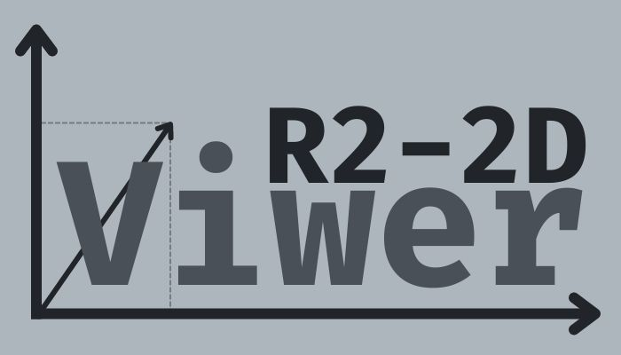

# R2-2D Viwer

<!--  -->

> Uma aplicação web para auxliar a visualização de vetores no R2

## Sobre o projeto

R2-2D Viwer é um projeto simples, em desenvolvimento, feito para solucionar uma demanda acadêmica para a matéria de Análise Espacial.

### Ajustes e melhorias

O projeto ainda está em desenvolvimento e próximas atualizações serão voltadas nos seguintes recursos:

- [ ] COMING SOON

## 📝 Licença

Esse projeto está sob licença. Veja o arquivo [LICENÇA](./LICENSE) para mais detalhes.